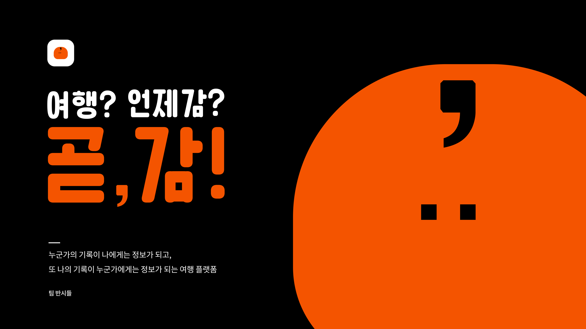

# 곧,감 (Got Gam)

키워드 기반 여행 경험 공유 SNS
## 개발 목표
- 마이크로서비스 구조(Microservice Architecture, MSA)로 작성된 서비스를 모놀리식 서비스로 변경
  - 각 마이크로 서비스를 서비스 단위로 분리
  - 종속성을 가지는 마이크로 서비스를 하위 서비스로 편입
  - 각 서비스는 하나의 엔티티에 대한 권한을 가짐
- 테스트 주도 개발(Test Driven Development, TDD) 방식 적용
- Entity, Service, Controller, Repsitory의 책임 분리
  - 각 구성요소는 서로 추상화되어 있으며, 인터페이스를 통하여 소통
## 구조 
Client <- DTO ->controller <- DTO -> service <- DAO -> Entity - Repository <- DAO -> Database
## Team 반시
- 정진호 Backend Developer [zzzinho Github](https://github.com/zzzinho)
- 곽혜원 Frontend Developer [YumYumNyang Github](https://github.com/YumYumNyang)
- 김승혜 Designer/Marketer [GotGam 1.0 Repo](https://github.com/bannsi/got-gam-client)
- 이영희 Designer/Product Manager [GotGam 1.0 Repo](https://github.com/bannsi/got-gam-client)